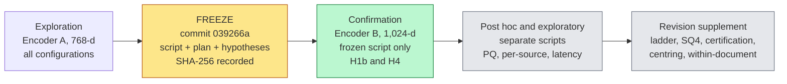

# Certifying Compressed Retrieval Indexes by Their Weakest Source
### An equal-memory study on legal text: code, frozen plan, post hoc supplement and logs

This repository accompanies the paper *"Certifying compressed retrieval indexes by their weakest source: An equal-memory study on legal text"*. It contains the analysis code, the time-stamped frozen analysis plan, the hypothesis file, execution logs, verification scripts and derived result files. **Benchmark data and embeddings are not redistributed**; they can be regenerated from the original sources, and SHA-256 digests allow verification.

Section 12 lists which stages of the work are frozen and which were added afterwards.

**Status labels used throughout:** **[C]** confirmatory (frozen hypothesis, hold-out encoder), **[P]** post hoc (run after the freeze, separate scripts, intervals not adjusted for multiplicity), **[E]** exploratory.

---

## 1. The paper in one page

**Question.** A dense retriever's index grows with the document collection. Given a fixed byte budget per vector, is it better spent on **more dimensions** or on **more bits per dimension**, how do product quantisation (PQ) and scalar codes compare at the same memory, and do pooled averages hide sources that fail?

**Setting.** 160,340 chunks from 714 public legal documents (CUAD, MAUD, ContractNLI, PrivacyQA; LegalBench-RAG derivative), 6,877 distinct queries, two encoders (768-d and 1,024-d).

**Four gaps addressed**

| Gap | Common practice | What this study does |
|---|---|---|
| Unit of comparison | Equal dimension or equal code length (different memories) | **Equal serialised bytes**, projection matrices and codebooks charged |
| Unit of averaging | One pooled mean | **Per-source** results, **worst-source lower bound**, two ceilings (exact search, contract oracle) |
| Unit of replication | Tune and report on the same queries | **Frozen plan** explored on encoder A, **tested on hold-out encoder B** |
| Saturation and learned codes | Unknown where trading precision for dimensions stops paying; PQ rarely compared at exact memory | Precision ladder (float32, fp16, 8-bit, 4-bit) and PQ against scalar codes at matched memory, judged by the weakest source |

**Headline findings**

| # | Finding | Status |
|---|---|---|
| 1 | At equal bytes, **8-bit PCA beats float32 PCA at all six tested budgets** (B = 32 to 768) in both encoders (macro nDCG@10: A +0.0104 to +0.0373; B +0.0103 to +0.0509). At equal dimension the two codings do not differ, so the gain equals the 4x more dimensions the same bytes buy. | [C] |
| 2 | **Compression raises cross-source confusion** (top-1 chunk drawn from another source) in every source with enough contracts (up to +0.40). | [C] |
| 3 | The ordering float32 < fp16 < 8-bit < 4-bit holds up to B = 192 in both encoders; gains concentrate where the richer code has roughly 100 to 200 dimensions; **4-bit and 8-bit codes are not distinguishable at B = 384** in the full corpus. | [P] |
| 4 | At matched memory, **PQ on raw embeddings exceeds PCA+SQ8 in nine of twelve settings**; PCA+SQ4 is not distinguishable from PQ in encoder A and exceeds it in encoder B. | [P] |
| 5 | **Macro averages hide opposite source-level changes**: PCA+SQ8 at B = 768 keeps macro retention 0.985 / 1.008 (A / B) while CUAD retention is 0.928 / 0.909 and ContractNLI is 1.069 / 1.209. | [P] |
| 6 | **Worst-source certification changes the choice.** Of 21 candidates per encoder, two met both floors (R^L >= 0.95, W^L >= 0.90): PQ with m = 384 (A, 59.5 MiB) and PQ with m = 512 (B, 79.3 MiB), each about one eighth of the exact index. Four PCA-based scalar configurations met the macro floor but failed the worst-source floor. | [P] |
| 7 | With vectors fixed, an IVF index (nprobe = 32) retains 0.991 at about 31x lower latency; PQ with m = 512 scans slower than exact search. Latency is an indexing problem, not a compression problem. | [E] |
| 8 | An **interval-based selection rule** and a **source-level monitoring protocol** for builders and maintainers of retrieval components. | method |

---

## 2. Study design



**Principles**

1. Compare compression methods at **matched serialised bytes** (Eq. 7 in the paper).
2. Compare approximate indexes only with **exact search over the same vectors**.
3. Report every result **by source**, next to the pooled average.
4. Resample **contracts** (cluster bootstrap, 95% percentile intervals), because queries within a contract share evidence.
5. Treat intervals that include zero as "not distinguishable from zero", never as equality.
6. Certify a configuration only if the **lower interval bounds** of macro and worst-source retention clear stated floors.

### Compression families

| Configuration | Stored representation | Bytes per vector | Budgets B |
|---|---|---|---|
| Raw (reference) | float32, D dims | 4D | n/a |
| RPf32 / PCAf32 | float32, d = B/4 | B | 16 to 1,536 |
| PCAfp16 | fp16, d = B/2 | B | 16 to 768 |
| RPsq8 / PCAsq8 | 8-bit, d = B | B | 16 to 768 |
| PCAsq4 | 4-bit, d = 2B | B | 16 to 384 (undefined at 768) |
| PCA 1-bit | sign code, d = 8B (capped at D) | B | single seed, exploratory |
| PQ | m = B codes of 8 bits, on raw embeddings | B + codebook | A: m up to 384; B: m up to 512 (m must divide D) |
| OPQ | rotation + PQ | B + codebook | single seed, reduced training, rotation not charged |
| IVF-Flat / HNSW | raw or PCAf32 vectors | + index overhead | 1,024 lists, nprobe 8/32/128; M = 32, efSearch = 64 |

Same bytes, different spending:

```
B = 192 bytes per vector
  float32  : 48 dimensions x 4 bytes
  fp16     : 96 dimensions x 2 bytes
  8-bit    : 192 dimensions x 1 byte      <- 4x more coordinates than float32
  4-bit    : 384 dimensions x 0.5 byte
  PQ       : 192 sub-quantiser codes (+ 0.75 / 1.00 MiB codebook)
```

PQ is trained on and encodes the **raw** embeddings; the scalar codes are built on **centred, projected and renormalised** vectors. All PQ-versus-scalar contrasts are therefore **pipeline-level** comparisons (quantiser plus its natural preprocessing), not quantiser-level ones.

### Corpus

| Source | Contracts | Chunks | Queries | Raw nDCG@10 (A) | Raw nDCG@10 (B) | In verdicts |
|---|---:|---:|---:|---:|---:|---|
| ContractNLI | 95 | 2,063 | 977 | 0.0815 | 0.0876 | yes |
| CUAD | 461 | 51,771 | 4,034 | 0.1159 | 0.1713 | yes |
| MAUD | 150 | 106,149 | 1,674 | 0.0077 | 0.0101 | yes |
| PrivacyQA | 7 | 357 | 194 rows (192 distinct) | 0.2629 | 0.3175 | no (< 20 contracts) |
| **Macro (3 sources)** | n/a | 160,340 | 6,879 rows (6,877 distinct) | **0.0684** | **0.0897** | n/a |

All verdicts use the 6,685 queries of ContractNLI, CUAD and MAUD. Query exclusions (6,889 benchmark queries, ten excluded before analysis, two repeated PrivacyQA rows): 8 CUAD queries without an annotated span, 2 MAUD queries (`maud_8`, `maud_586`) flagged in an earlier version of the span-to-chunk mapping, and 2 duplicated PrivacyQA rows. Every query names its contract (document-naming design), which shapes what can be concluded.

### Encoders

| | Model | Dim | Query / chunk prefix |
|---|---|---:|---|
| A (exploration) | `BAAI/bge-base-en-v1.5` | 768 | none (retrieval instruction not used in the main analyses) |
| B (hold-out) | `intfloat/e5-large-v2` | 1,024 | `query: ` / `passage: ` |
| third (diagnostic only) | Snowflake `arctic-embed-m-v1.5` | 768 | used only for a preprocessing diagnostic (appendix) |

Both main encoders embed the same chunks and queries, so the hold-out tests **robustness to the encoder, not to a new document sample**.

---

## 3. Hypothesis register

| ID | Statement | Status | Encoder A | Encoder B |
|---|---|---|---|---|
| H1a | PCAf32 > RPf32 at equal B | descriptive | 2/8 pass | 8/8 pass |
| **H1b** | **PCAsq8 > PCAf32 at equal B (B >= 32)** | **frozen** | 6/6 | **6/6 [C]** |
| H2b | Source indicators add < 0.02 deviance R² | descriptive | inconclusive | supported |
| H3a, H3b | Identification-share decomposition | not interpreted | negative components | negative components |
| **H4** | **Cross-source top-1 confusion rises under compression, every source** | **frozen** | 3/3 | **3/3 [C]** |
| H5 | BM25 top-3 documents, then dense > global dense | descriptive | supported | supported |

A universal claim is supported only if **every** non-excluded row passes at Holm-adjusted alpha = 0.05. One choice was not blind: the H4 configuration (RPf32, d = 48) was selected after inspecting Encoder A, so H4 confirms a direction on a hold-out encoder, not a configuration fixed in advance. `prereg.json` also lists an optimised-PQ hypothesis (H1c) that was declared but **not evaluated as a frozen test**; OPQ appears only in a reduced, single-seed post hoc analysis and is indicative only.

---

## 4. Key results

All intervals are 95% contract-cluster bootstrap intervals in the paper; this README gives point values and points to the CSV files. Post hoc intervals are not adjusted for multiplicity.

### 4.1 Memory-quality frontier, frozen implementation (retention of exact-search macro nDCG@10)

| B (bytes) | PCAsq8 MiB | PCAsq8 (A) | PQ (A) | PCAsq8 (B) | PQ (B) |
|---:|---:|---:|---:|---:|---:|
| 16 | 2.4 | 0.047 | 0.182 | 0.047 | 0.111 |
| 32 | 4.9 | 0.161 | 0.357 | 0.132 | 0.246 |
| 64 | 9.8 | 0.341 | 0.664 | 0.306 | 0.441 |
| 96 | 14.7 | 0.522 | 0.778 | 0.475 | n/a |
| 192 | 29.4 | 0.798 | 0.929 | 0.791 | n/a |
| 384 | 58.7 | **0.964** | 0.993 | **0.976** | n/a |
| 768 | 117.4 | 0.982 | 1.003 | 1.009 | n/a |

PQ for Encoder B requires m to divide 1,024, so B = 96, 192, 384, 768 are unavailable. Retention above 1 is within noise. PQ with m = 384 and 512 was added in the certification extension (Section 4.6).

### 4.2 Bits versus dimensions at equal bytes [C]

| | Encoder A | Encoder B |
|---|---|---|
| PCAsq8 minus PCAf32, range over B = 32..768 | +0.0104 to +0.0373 | +0.0103 to +0.0509 |
| Holm-adjusted p (all six budgets) | 0.0057 (bootstrap resolution limit) | 0.0057 |
| Equal dimension (d = 384), 8-bit minus float32 | -0.0001 [-0.0003, +0.0001] | +0.0000 [-0.0004, +0.0004] |

The advantage is hump-shaped in B and largest at B = 192 (+0.0376 for A, +0.0513 for B in the post hoc reimplementation). A second-moment argument (Proposition 1, Appendix D of the paper) shows that 8-bit rounding noise is about 1e-4 of the score variance, while float32 truncation to a quarter of the dimensions discards a spectrum-dependent fraction. It accounts for the shrinking gain at large B but **not** for the small gain at small B (a floor effect is consistent with this but not demonstrated).

### 4.3 Precision ladder [P]

Retention of exact-search macro nDCG@10 by stored code (post hoc reimplementation, five seeds for the PCA fitting sample):

| B | A f32 | A fp16 | A 8-bit | A 4-bit | B f32 | B fp16 | B 8-bit | B 4-bit |
|---:|---:|---:|---:|---:|---:|---:|---:|---:|
| 16 | 0.005 | 0.009 | 0.043 | 0.140 | 0.008 | 0.015 | 0.049 | 0.115 |
| 32 | 0.009 | 0.042 | 0.165 | 0.308 | 0.015 | 0.050 | 0.131 | 0.292 |
| 64 | 0.042 | 0.166 | 0.342 | 0.624 | 0.049 | 0.130 | 0.304 | 0.574 |
| 96 | 0.100 | 0.249 | 0.524 | 0.777 | 0.075 | 0.221 | 0.477 | 0.767 |
| 192 | 0.249 | 0.524 | 0.799 | 0.944 | 0.221 | 0.478 | 0.793 | 0.963 |
| 384 | 0.524 | 0.800 | 0.964 | 0.964 | 0.477 | 0.794 | 0.976 | 0.988 |
| 768 | 0.800 | 0.964 | 0.985 | n/a | 0.794 | 0.975 | 1.008 | n/a |

At equal dimension fp16 equals float32 and 8-bit coding costs about 0.001 of retention; 4-bit coding costs 0.013 to 0.026, but buys twice as many dimensions, so it wins while dimensions are scarce. At B = 384 the 4-bit and 8-bit codes are not distinguishable in the full corpus; within the gold document the 8-bit code is better for Model A, so the full-corpus tie is not a general equivalence. The "roughly 100 to 200 dimensions" regularity is exploratory (the budget grid doubles in step).

### 4.4 PQ against PCA-based scalar codes at matched memory [P]

PQ minus scalar code, macro nDCG@10 (pipeline-level; PQ seeds: 5, and 3 for m = 384 and 512):

| Model | m | MiB | PQ minus SQ8 | PQ minus SQ4 |
|---|---:|---:|---|---|
| A | 16 | 3.20 | +0.0082 | +0.0008 (includes 0) |
| A | 32 | 5.64 | +0.0135 | +0.0003 (includes 0) |
| A | 64 | 10.54 | +0.0187 | -0.0005 (includes 0) |
| A | 128 | 20.32 | +0.0122 | -0.0020 (includes 0) |
| A | 256 | 39.90 | +0.0045 | +0.0001 (includes 0) |
| A | 384 | 59.47 | +0.0014 (includes 0) | not defined |
| B | 16 | 3.45 | +0.0024 | -0.0070 |
| B | 32 | 5.89 | +0.0055 | -0.0107 |
| B | 64 | 10.79 | +0.0092 | -0.0151 |
| B | 128 | 20.57 | +0.0091 | -0.0139 |
| B | 256 | 40.15 | +0.0019 (includes 0) | -0.0047 |
| B | 512 | 79.29 | -0.0011 (includes 0) | not defined |

PQ exceeds PCA+SQ8 in nine of twelve settings (weak evidence at m = 16 for B). Charging the PCA projection matrix to the scalar codes did not change the ordering.

### 4.5 Cross-source confusion [C]

Share of top-1 chunks drawn from a different source, RPf32 d = 48 minus raw (H4):

| Source | Encoder A | Encoder B |
|---|---|---|
| ContractNLI | +0.376 [0.335, 0.419] | +0.396 [0.355, 0.437] |
| CUAD | +0.185 [0.171, 0.199] | +0.334 [0.321, 0.347] |
| MAUD | +0.165 [0.148, 0.182] | +0.208 [0.194, 0.224] |

Restricting candidates to the query's source removes this failure channel (macro 0.0684 to 0.0748 for A, 0.0897 to 0.1017 for B); this was measured at full precision only, not under compression.

### 4.6 Worst-source certification [P]

Rule (Eq. 18): minimise adjusted memory subject to R^L >= 0.95 and W^L >= 0.90, where R^L and W^L are the 2.5th percentiles of macro retention and of the per-replicate minimum source retention (4,000 contract-cluster resamples). Floors are policy parameters, not empirical thresholds.

| Model | Configuration | Adj. MiB | R (R^L) | ContractNLI | CUAD | MAUD | W^L | Certified |
|---|---|---:|---|---:|---:|---:|---:|---|
| A | PQ, m=64 | 10.5 | 0.644 (0.591) | 0.385 | 0.824 | 0.681 | 0.296 | No |
| A | SQ4, B=96 | 15.2 | 0.777 (0.739) | 0.742 | 0.802 | 0.774 | 0.633 | No |
| A | PQ, m=128 | 20.3 | 0.854 (0.816) | 0.730 | 0.939 | 0.879 | 0.648 | No |
| A | SQ4 matched, m=128 | 21.1 | 0.882 (0.855) | 0.898 | 0.873 | 0.852 | 0.730 | No |
| A | SQ4, B=192 | 30.5 | 0.944 (0.918) | 1.000 | 0.907 | 0.912 | 0.779 | No |
| A | PQ, m=256 | 39.9 | 0.963 (0.944) | 0.917 | 0.993 | 0.998 | 0.877 | No (R^L 0.944) |
| A | SQ4 matched, m=256 | 41.4 | 0.961 (0.935) | 1.036 | 0.910 | 0.934 | 0.799 | No |
| A | **PQ, m=384** | **59.5** | **0.989 (0.979)** | 0.979 | 0.997 | 0.978 | **0.921** | **Yes** |
| A | SQ8 matched, m=384 | 60.6 | 0.968 (0.941) | 1.036 | 0.924 | 0.922 | 0.790 | No |
| A | SQ4, B=384 | 61.0 | 0.964 (0.937) | 1.043 | 0.910 | 0.930 | 0.797 | No |
| A | SQ8, B=768 | 119.7 | 0.985 (0.956) | 1.069 | 0.928 | 0.953 | 0.822 | No (macro passes) |
| B | PQ, m=128 | 20.6 | 0.736 (0.697) | 0.519 | 0.848 | 0.712 | 0.437 | No |
| B | SQ4 matched, m=128 | 21.7 | 0.891 (0.851) | 0.878 | 0.893 | 0.951 | 0.768 | No |
| B | SQ4, B=192 | 30.9 | 0.963 (0.929) | 1.064 | 0.912 | 0.947 | 0.840 | No |
| B | PQ, m=256 | 40.1 | 0.934 (0.914) | 0.879 | 0.959 | 0.982 | 0.829 | No |
| B | SQ4 matched, m=256 | 42.3 | 0.987 (0.949) | 1.154 | 0.904 | 0.927 | 0.822 | No (R^L 0.949) |
| B | SQ8, B=384 | 60.2 | 0.976 (0.941) | 1.074 | 0.927 | 0.959 | 0.839 | No |
| B | SQ4, B=384 | 61.7 | 0.988 (0.952) | 1.168 | 0.901 | 0.903 | 0.795 | No (macro passes) |
| B | **PQ, m=512** | **79.3** | **0.994 (0.986)** | 0.991 | 0.997 | 1.009 | **0.974** | **Yes** |
| B | SQ8 matched, m=512 | 81.4 | 1.006 (0.967) | 1.186 | 0.918 | 0.941 | 0.835 | No (macro passes) |
| B | SQ8, B=768 | 120.4 | 1.008 (0.968) | 1.209 | 0.909 | 0.928 | 0.821 | No (macro passes) |

The table lists the configurations that bear on the decision; the full candidate set (21 per encoder) is in `out_full/paper/certification.csv`. Source columns are retention against each source's own exact search. Retention above 1.0 is read only as "not lower than exact search".

Reading: by macro retention alone four scalar configurations would be admissible (PCA+SQ8 at B = 768 in both encoders, matched PCA+SQ8 at m = 512 and PCA+SQ4 at B = 384 in Model B); the worst-source bound excludes all four (W^L between 0.795 and 0.835, binding source CUAD). For PQ m = 384 (Model A) the frozen implementation gives R = 0.993, W^L = 0.947 and the reimplementation R = 0.989, W^L = 0.921; both clear the 0.90 floor. Certification refers to agreement with this benchmark's annotated relevance, not to answer quality.

### 4.7 Where the loss is, and what fixes latency

| Observation | Value |
|---|---|
| Exact search, macro nDCG@10 (A / B) | 0.0684 / 0.0897 |
| Contract oracle (restrict to annotated contract) | 0.2327 / 0.2888 |
| Within-document oracle (description removed from query; 262 distinct questions; not comparable with full-corpus scores) | 0.4211 / 0.4540 |
| BM25 top-3 documents, then dense (H5), gain | +0.0684 / +0.0916 |
| Raw IVF nprobe = 32, quality ratio / speed-up (B) | 0.991 / 31x (1.418 vs 43.416 ms) |
| PCAf32 B768 + HNSW, quality ratio / speed-up (B) | 0.990 / 77x |
| PQ at B = 512 (the certified index for B) | 62.05 ms, slower than raw exact search (43.7 ms) |
| Latency of PQ m = 384, PCA+SQ4, 1-bit | not measured |

Latency was measured single-threaded on a shared server (load average 28.9 to 3.7); treat absolute values as indicative and use ratios.

---

## 5. Practical outputs for system builders

### 5.1 Interval-based selection rule

```
c* = argmin_c  adjusted_memory(c)
     subject to  R_L(c) >= 0.95   (lower 95% bound of macro retention)
                 W_L(c) >= 0.90   (lower 95% bound of worst-source retention)
```

Floors are policy parameters. Instantiation on this benchmark:

| Scenario | Encoder A | Encoder B |
|---|---|---|
| Interval-based (reference) | PQ m = 384, 59.5 MiB | PQ m = 512, 79.3 MiB |
| Macro-point-estimate reading (not recommended) | PCA+SQ8 B = 768 would pass the macro floor, but is larger and fails W^L (0.822) | PCA+SQ4 B = 384 (61.7 MiB) would be preferred over PQ but fails W^L (0.795) |
| Latency first | IVF nprobe = 32 | raw IVF nprobe = 32 (1.42 ms) or PCAf32 B768 + HNSW (0.102 ms) |
| Not recommended | B <= 32; RPf32 at every budget | same |

Sensitivity: for Model A the choice does not change for any W floor up to 0.921; for Model B it changes only if the floor is lowered to 0.795 or below, and PQ is the only admissible configuration between 0.835 and 0.974. Latency of the certified indexes (Model A m = 384) was not measured; in Model B the certified index scans slower than exact search, so a latency-first objective can remove it from the candidate set.

### 5.2 Design rules (conditional on this benchmark)

| Memory range | Rule |
|---|---|
| up to about 40 MiB | Use PCA with 4-bit codes (needs no training) as the default candidate and PQ as the comparator; no candidate met both floors here, and PQ m = 256 (A) came closest (R^L 0.944, W^L 0.877). |
| about 60 MiB and above | Include PQ on raw embeddings with D/m = 2 (m = 384 for A, m = 512 for B) among the candidates and certify it; PCA-based scalar codes failed the worst-source floor up to about 120 MiB. |
| all budgets | Lower the precision and raise the dimension while the richer representation has fewer than roughly 100 to 200 dimensions (exploratory). |
| all budgets | Check centring per encoder, validate random projection empirically, do not rank PCA against RP from one draw. |
| all budgets | Read results by source and, where metadata exist, restrict the candidate pool by document or source (measured at full precision only). |

### 5.3 Source-level monitoring protocol

1. Keep an exact-search reference over the same vectors for an audit sample of logged queries.
2. At each audit, compute retention by source and the worst-source bound W^L (contract-cluster bootstrap); alert when W^L < 0.90.
3. Track cross-source confusion X_s against the reference; alert when its increase exceeds a policy margin that the system owner sets.
4. On an alert, restrict the candidate pool by document or source metadata where it exists, and reconsider the configuration.
5. When the encoder is replaced, repeat steps 1 to 3 and check centring.
6. Recompute the certification periodically on the current audit sample. A source with too few contracts for a meaningful bootstrap (here PrivacyQA with seven) is reported as unassessed, not passed.

---

## 6. Repository contents

### Frozen stage and earlier post hoc stage

| Path | Role |
|---|---|
| `cfr_v2.py` | **Frozen analysis script** (SHA-256 in Section 7) |
| `prereg.json` | Frozen hypothesis file |
| `analysis_plan.md` | Frozen analysis plan |
| `freeze_hashes.txt` | SHA-256 digests recorded at freeze |
| `cfr.py`, `patch_cfr.py` | Earlier exploration version and patch |
| `stage_h_lbrag.py` | Corpus and baseline stage for the LegalBench-RAG derivative |
| `convert.py`, `chk_keep.py`, `diag_align.py` | Conversion to analysis format, keep-flag check, alignment diagnostics |
| `verify_qrels.py`, `verify_qrels.log`, `verify_qrels_result.csv` | Gold-chunk validation against original spans (recall = precision = 1.000, four sources) |
| `run_missing_analyses.py`, `posthoc_persource.py` | Post hoc analyses (separate from the frozen script) |
| `pq_supplement.py`, `pcasq8_exact.py`, `latency_remeasure.py` and their `.log` files | Post hoc PQ supplement, exact-memory match, latency re-measurement |
| `explore_full*.log` | Exploration runs on Encoder A |
| `confirm_B.log`, `make_emb_B.log` | Confirmation run and embedding log, Encoder B |
| `out_full/{explore_A,confirm_B,posthoc_pq_B}/` | Frontier figures and result files of the earlier stages |
| `paper_results/digest.txt` | Freeze-integrity digest and pre-registration record |
| `env_freeze.txt` | Package versions |

### Revision supplement (post hoc, run after the freeze)

| Analysis | Scripts | Outputs |
|---|---|---|
| Common evaluation core | `evalcore.py` | n/a |
| Precision ladder (fp16, 8-bit, 4-bit) | `supp_bits_ladder.py`, `supp_all.py` | `out_full/supp2/{A,B}_std/ladder_*.csv`, `agg_ladder_*.txt` |
| PQ vs PCA+SQ8 / SQ4 at matched memory; adjusted memory; OPQ | `supp_all.py`, `supp_pq_opq.py`, `agg_pq.py` | `out_full/supp2/{A,B}_std/pq_*.csv`, `adjusted_memory.csv` |
| Certification (R^L, W^L; PQ m = 384, 512) | `cert_table.py`, `final_checks.py` | `out_full/paper/certification.csv`, `out_full/supp2/cert_table.txt`, `{A,B}_std/worst_source.csv` |
| Centring x projector; preprocessing diagnostic; RP with ten draws | `supp_centring.py`, `supp_centring2.py`, `diag_centre.py`, `diag_norm.py`, `diag_preproc.py` | `out_full/supp2/*/centring.csv`, `rp10.csv` |
| Within-document ladder; instruction queries; 1-bit codes; recall proxy | `withindoc.py`, `supp_embed_q_instr.py`, `bin_contrast.py`, `supp_extra.py` | `out_full/supp2/{A_wd_noname,B_wd_noname,A_instr}/`, `binary.csv`, `recall.csv` |
| Third encoder (appendix diagnostic) | `embed_mrl.py`, `diag_m.py`, `noname.py` | `out_full/supp2/M_std/` |
| Energy argument, supplementary check | `tau_kappa.py` | `out_full/tau_kappa/` |
| Figures and tables of the revision | `make_paper_items.py` | `out_full/paper/`, `out_full/paper_revised/` |
| Run drivers and checks | `run_all_supp.sh`, `run_extra.sh`, `precheck.py` | `out_full/supp2/run_all.log`, `run_extra.log`, `precheck.txt` |

`tau_kappa.py` is a supplementary check with its own PCA fitting sample; its tau values are not identical to Table 8 of the manuscript (for example 0.417 against 0.485 at B = 16, Model A). The manuscript's table is the reference.

### Git history (order of work)

| Commit | Meaning |
|---|---|
| `039266a` | **Freeze**: confirmatory H1b and H4 (explored on Model A) |
| `d92bc65`, `4345282` | Post hoc, not confirmatory: PQ supplement, exact-memory match, latency re-measurement, per-source contrasts |
| `b8784e3` | Post hoc, not confirmatory: precision ladder, SQ4/PQ matched memory, certification, tau/kappa, centring, within-document, third-encoder diagnostics |
| tag `v2-revision` | State of the repository accompanying the revised manuscript |

A commit is a time-stamped record, not an external registry; the repository release time follows the results. We therefore speak of a *frozen plan* and a *hold-out encoder*, not of a formal pre-registration.

---

## 7. Integrity checks

| Item | SHA-256 |
|---|---|
| `cfr_v2.py` (frozen script) | `98cef001be37048018233a56cb001afaad6cf7ffd42a9721ae9cfe0ef736beb3` |
| `prereg.json` | `d52eed76013f453ce09f98b2bafada6a10db8808c0839428a0a0793225c27c90` |
| `analysis_plan.md` | `95602571806b3872434479f4378376254a02d9517fc4de048c1adb48b589b6e1` |
| `data/chunks.parquet` | `be2885f9b2d9b44fc5101637b7ca01f7ec7f261c38b54d85a59ed6e412f2bf30` |
| `data/queries.parquet` | `86d3c7172d28f9ebbc295cd4eb5860b53b31da8d5741a37716bdb8e5d798b8ff` |

```bash
sha256sum cfr_v2.py prereg.json analysis_plan.md
sha256sum data/chunks.parquet data/queries.parquet
sha256sum -c post_freeze_hashes.txt    # revision-supplement scripts
```

The frozen files are unchanged since commit `039266a`. If you read an anonymised mirror of this repository, replacement of identifying strings (user names, home paths) can make the digests of mirrored text files differ from those listed here; verify against a direct clone where possible.

`data/queries.parquet` holds 6,879 queries (6,889 minus the ten flagged with `keep = False`: 8 CUAD + 2 MAUD); two duplicate PrivacyQA queries are removed at run time, giving the 6,877 analysed queries.

---

## 8. Reproducing the results

**Environment:** Python 3.12.3, FAISS 1.15.1, NumPy 2.5.3, SciPy 1.18.1 (see `env_freeze.txt`). Reference hardware: 24-thread Xeon Silver 4410Y, shared server. Run all scripts from the repository root.

```bash
python -m venv venv && source venv/bin/activate
pip install -r env_freeze.txt      # or install the versions above
```

**Step 1. Obtain the data (not redistributed).** Download the LegalBench-RAG corpus from its original release, rebuild chunks (at most 500 characters) and queries with `stage_h_lbrag.py` and `convert.py`, and write:

```
data/chunks.parquet     # columns: source, doc_id, text           (160,340 rows)
data/queries.parquet    # columns: qid, source, text, gold_chunks (6,879 rows)
```

Check both files against the SHA-256 digests in Section 7 and validate gold chunks with `verify_qrels.py`.

**Step 2. Embed.** `cfr_v2.py` builds embeddings with SentenceTransformers (`--make_emb`, `--d_prefix`, `--q_prefix`, `--model`, `--data_dir`). Prefixes must match the study:

```bash
# Encoder A: no prefixes
python cfr_v2.py --data_dir data --model A --make_emb BAAI/bge-base-en-v1.5
# Encoder B: E5 prefixes
python cfr_v2.py --data_dir data --model B --make_emb intfloat/e5-large-v2 \
       --d_prefix "passage: " --q_prefix "query: "
```

Embeddings are written to `data/emb/{A,B}/{chunks,queries}.npy` (L2-normalised). Run `python cfr_v2.py --help` for the analysis options; the executed commands are recorded in the logs (`explore_full*.log`, `confirm_B.log`).

**Step 3. Frozen and earlier post hoc analyses.** Exploration on A, then the frozen script on B (`confirm_B.log`), then `run_missing_analyses.py` and `posthoc_persource.py`. The frozen run used 4,000 bootstrap resamples; those post hoc analyses used an independent implementation with 2,000 resamples and seed 20261004.

**Step 4. Revision supplement.** The drivers `run_all_supp.sh` and `run_extra.sh` call the scripts listed in Section 6 and write to `out_full/supp2/`; `cert_table.py` produces `out_full/paper/certification.csv` (4,000 resamples); `make_paper_items.py` builds the figures and tables. Check each script's header or `--help` for its arguments before running. The per-seed intermediate arrays (`*.npy`) used by the aggregation scripts are **not included** in this repository because of their size, so aggregation scripts need the earlier stages to be re-run first; the aggregated CSV and text results are included.

**Reproducibility caveats**

- The frozen runs used one seed for the PCA fitting sample, PQ k-means initialisation and IVF training sample; RP results average three draws. The revision varied seeds only partly (ladder: PCA sample, five seeds; PQ comparisons: five seeds, three for m = 384 and 512; adjusted memory: three; RP: ten draws in the reanalysis; OPQ and 1-bit: one). Bootstrap intervals describe contract sampling and **do not include seed or draw variation**.
- Resample counts differ by analysis (4,000 frozen and certification; 2,000 ladder and PQ comparisons; 1,000 centring and recall).
- Latency depends on machine load. Compare ratios, not milliseconds.
- 8-bit scan time per dimension is about ten times higher when d is not a multiple of eight (paper, Appendix C); latency for the matched PCA+SQ8 dimensions is therefore not compared.

---

## 9. Limitations (read before reusing the conclusions)

| Limitation | Consequence |
|---|---|
| One corpus family (four public legal sources) | No claim for other contract types, languages or enterprise collections |
| Every query names its contract | Document-hit, H5 and source-scoping results may not transfer to open questions |
| Encoder B embeds the same corpus and queries | Robustness to the encoder, **not** to the document sample |
| H4 configuration chosen after seeing Encoder A | Confirms a direction on a hold-out encoder, not a fixed-in-advance configuration |
| Only H1b and H4 are confirmatory | The precision ladder beyond 8 bits, the PQ comparisons, source-level analyses and certification are post hoc, run with a separate implementation and not adjusted for multiplicity |
| Pipeline-level PQ versus scalar comparison | PQ uses raw embeddings, scalar codes use centred, projected vectors; the gap in worst-source bounds cannot be attributed to the quantiser alone |
| Certification only within the evaluated grid | B <= 768; PQ with m <= 384 (A) and m <= 512 (B); floors are policy parameters |
| PCA versus RP confounded by centring | No general ranking of the two projectors; centring effect was far larger in a third encoder |
| OPQ and 1-bit codes: single seed, reduced settings | Indicative only; OPQ rotation matrix not charged |
| Seeds varied only partly | Seed-to-seed variability is not included in any interval |
| Latency of PQ m = 384, PCA+SQ4 and 1-bit not measured | Latency-first conclusions rest on a subset of configurations |
| Within-document analysis is an oracle with 262 distinct questions | Not comparable with full-corpus scores |
| MAUD baseline nDCG@10 of 0.008 to 0.010 | Its retention is unstable; PrivacyQA (7 contracts) excluded from verdicts |
| nDCG@10 and hit@10 against annotated spans only | No downstream answer quality and no human relevance judgements; "certified" means agreement with annotated relevance |
| Model A used without the bge retrieval instruction | Results describe that usage (instruction examined for the ladder only) |

---

## 10. Data availability and licences

Benchmark chunk and query files are derived from CUAD, MAUD, ContractNLI and PrivacyQA through LegalBench-RAG and are **not redistributed**. They can be regenerated from the original sources with the code here, and the SHA-256 digests above allow verification. Please consult the original dataset licences before reuse.

## 11. Citation

Citation details are omitted for anonymous review and will be added after publication.

---

## 12. Stages of the work

| Stage | Commit or tag | What it contains | Status |
|---|---|---|---|
| Frozen stage | `039266a` | Exploration on Encoder A, freeze of script, plan and hypotheses, confirmation on Encoder B (H1b, H4) | **[C]** for H1b and H4 only |
| Earlier post hoc stage | `d92bc65`, `4345282` | PQ supplement, exact-memory match, latency re-measurement, per-source contrasts | [P] / [E] |
| Revision supplement | `b8784e3`, tag `v2-revision` | Precision ladder (fp16, 8-bit, 4-bit), PQ with m = 384 and 512, lower bounds R^L and W^L and certification, centring crossed with projector, within-document analysis, third-encoder diagnostic | [P] / [E] |

The revision supplement uses a separate implementation. It reproduces the frozen retention of PCA+SQ8 at B = 384 (Model A 0.9644 against 0.964; Model B 0.9762 against 0.976). For PQ with m = 384 in Model A the frozen implementation gives R = 0.993 and W^L = 0.947, and the reimplementation gives R = 0.989 and W^L = 0.921; the certification verdict is the same. The frozen files (`cfr_v2.py`, `prereg.json`, `analysis_plan.md`, `freeze_hashes.txt`) and the confirmatory results are unchanged since the freeze. Intermediate per-seed arrays (`*.npy`) are not included; aggregated CSV and text results are.
