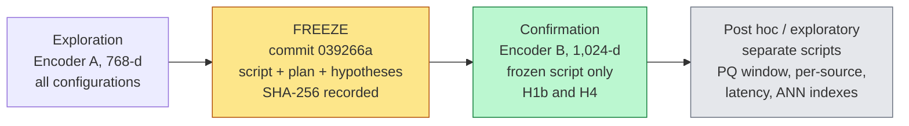

# Spending Bytes on Dimensions or on Bits?
### Equal-memory compression of dense retrieval indexes for contracts and policies: code, frozen plan and logs

This repository accompanies the paper *"Spending Bytes on Dimensions or on Bits? Equal-Memory Compression of Dense Retrieval Indexes for Contracts and Policies"*. It contains the analysis code, the time-stamped frozen analysis plan, the hypothesis file, execution logs, verification scripts and derived result files. **Benchmark data and embeddings are not redistributed**; they can be regenerated from the original sources, and SHA-256 digests allow verification.

---

## 1. The paper in one page

**Question.** A dense retriever's index grows with the document collection. Given a fixed byte budget per vector, is it better spent on **more dimensions** (float32 projection) or on **more bits per dimension** (8-bit scalar quantisation, product quantisation)? And do pooled averages hide sources that fail?

**Setting.** 160,340 chunks from 714 public legal documents (CUAD, MAUD, ContractNLI, PrivacyQA; LegalBench-RAG derivative), 6,877 queries, two encoders (768-d and 1,024-d).

**Three gaps addressed**

| Gap | Common practice | What this study does |
|---|---|---|
| Unit of comparison | Equal dimension or equal code length (different memories) | **Equal serialised bytes**, projection matrices and codebooks charged |
| Unit of averaging | One pooled mean | **Per-source** results, worst-source retention, two ceilings (exact search, contract oracle) |
| Unit of replication | Tune and report on the same queries | **Frozen plan** explored on encoder A, **tested on hold-out encoder B** |

**Headline findings** (labels: [C] confirmatory, [P] post hoc, [E] exploratory)

| # | Finding | Status |
|---|---|---|
| 1 | At equal bytes, **8-bit PCA beats float32 PCA at all six tested budgets** in both encoders (Encoder B: +0.0103 to +0.0509 macro nDCG@10). At equal dimension the two codings do not differ, so the gain equals the 4x more dimensions the same bytes buy. | [C] |
| 2 | **Compression raises cross-source confusion** (top-1 chunk from another source) in every source with enough contracts (up to +0.40). | [C] |
| 3 | **Product quantisation beats 8-bit PCA only in a mid-memory window** (5.9 to 20.6 MiB, Encoder B), and the advantage comes from one source (CUAD). | [P] |
| 4 | **Macro averages hide opposite source-level changes**: at 117 MiB, CUAD falls (-0.0155) while ContractNLI rises (+0.0186). | [P] |
| 5 | 8-bit PCA at 58.7 MiB retains **0.964 / 0.976** of exact-search quality (A / B). | [P] |
| 6 | With vectors fixed, an **IVF index (nprobe = 32) retains 0.991 at about 31x lower latency**. Latency is an indexing problem, not a compression problem. | [E] |
| 7 | An **interval-based selection rule** and a **source-level monitoring protocol** for practitioners. | method |

---

## 2. Study design



**Principles**

1. Compare compression methods at **matched serialised bytes** (Eq. 7 in the paper).
2. Compare approximate indexes only with **exact search over the same vectors**.
3. Report every result **by source**, next to the pooled average.
4. Resample **contracts** (cluster bootstrap, 95% percentile intervals), because queries within a contract share evidence.
5. Treat intervals that include zero as "not distinguishable from zero", never as equality.

### Compression families

| Configuration | Stored representation | Bytes per vector | Budgets B |
|---|---|---|---|
| Raw (reference) | float32, D dims | 4D | n/a |
| RPf32 / PCAf32 | float32, d = B/4 | B | 16 to 1,536 |
| RPsq8 / PCAsq8 | 8-bit, d = B | B | 16 to 768 |
| PQ | m = B codes of 8 bits | B + codebook | A: 16 to 768; B: 16 to 512 (m must divide D) |
| IVF-Flat / HNSW | raw or PCAf32 vectors | + index overhead | 1,024 lists, nprobe 8/32/128; M = 32, efSearch = 64 |

Same bytes, different spending:

```
B = 192 bytes per vector
  float32  : 48 dimensions x 4 bytes
  8-bit    : 192 dimensions x 1 byte      <- 4x more coordinates
  PQ       : 192 sub-quantiser codes (+ 0.75 / 1.00 MiB codebook)
```

### Corpus

| Source | Contracts | Chunks | Queries | Raw nDCG@10 (A) | Raw nDCG@10 (B) | In verdicts |
|---|---:|---:|---:|---:|---:|---|
| ContractNLI | 95 | 2,063 | 977 | 0.0815 | 0.0876 | yes |
| CUAD | 461 | 51,771 | 4,034 | 0.1159 | 0.1713 | yes |
| MAUD | 150 | 106,149 | 1,674 | 0.0077 | 0.0101 | yes |
| PrivacyQA | 7 | 357 | 192 | 0.2629 | 0.3175 | no (< 20 contracts) |
| **Macro (3 sources)** | n/a | 160,340 | 6,877 | **0.0684** | **0.0897** | n/a |

Query exclusions (6,889 original, 12 removed): 8 CUAD queries without an annotated span, 2 duplicated PrivacyQA queries, 2 MAUD queries (`maud_8`, `maud_586`) flagged in an earlier version of the span-to-chunk mapping. Every query names its contract (document-naming design), which shapes what can be concluded.

### Encoders

| | Model | Dim | Query / chunk prefix |
|---|---|---:|---|
| A (exploration) | `BAAI/bge-base-en-v1.5` | 768 | none (retrieval instruction not used) |
| B (hold-out) | `intfloat/e5-large-v2` | 1,024 | `query: ` / `passage: ` |

Both encoders embed the same chunks and queries, so the hold-out tests **robustness to the encoder, not to a new document sample**.

---

## 3. Hypothesis register

| ID | Statement | Status | Encoder A | Encoder B |
|---|---|---|---|---|
| H1a | PCAf32 > RPf32 at equal B | descriptive | 2/8 pass | 8/8 pass |
| **H1b** | **PCAsq8 > PCAf32 at equal B (B >= 32)** | **frozen** | 6/6 | **6/6 [C]** |
| H2b | Source indicators add < 0.02 deviance R² | descriptive | inconclusive | supported |
| H3a, H3b | Identification-share decomposition | not interpreted | negative components | negative components |
| **H4** | **Cross-source top-1 confusion rises under compression, every source** | **frozen** | 3/3 | **3/3 [C]** |
| H5 | BM25 top-3 documents, then dense > global dense | descriptive | supported | supported |

A universal claim is supported only if **every** non-excluded row passes at Holm-adjusted alpha = 0.05. One choice was not blind: the H4 configuration (RPf32, d = 48) was selected after inspecting Encoder A, so H4 confirms a direction on a hold-out encoder, not a configuration fixed in advance. `prereg.json` also lists an optimised-PQ hypothesis (H1c) that was declared but **not evaluated** in this study.

---

## 4. Key results

### 4.1 Memory-quality frontier (retention of exact-search macro nDCG@10)

| B (bytes) | PCAsq8 MiB | PCAsq8 (A) | PQ (A) | PCAsq8 (B) | PQ (B) |
|---:|---:|---:|---:|---:|---:|
| 16 | 2.4 | 0.047 | 0.182 | 0.047 | 0.111 |
| 32 | 4.9 | 0.161 | 0.357 | 0.132 | 0.246 |
| 64 | 9.8 | 0.341 | 0.664 | 0.306 | 0.441 |
| 96 | 14.7 | 0.522 | 0.778 | 0.475 | n/a |
| 192 | 29.4 | 0.798 | 0.929 | 0.791 | n/a |
| 384 | 58.7 | **0.964** | 0.993 | **0.976** | n/a |
| 768 | 117.4 | 0.982 | 1.003 | 1.009 | n/a |

PQ for Encoder B requires m to divide 1,024, so B = 96, 192, 384, 768 are unavailable. Retention above 1 is within noise. Intervals are in the paper (Table 6).

### 4.2 Bits versus dimensions at equal bytes [C]

| | Encoder A | Encoder B |
|---|---|---|
| PCAsq8 minus PCAf32, range over B = 32..768 | +0.0104 to +0.0373 | +0.0103 to +0.0509 |
| Holm-adjusted p (all six budgets) | 0.0057 (bootstrap resolution limit) | 0.0057 |
| Equal dimension (d = 384), 8-bit minus float32 | -0.0001 [-0.0003, +0.0001] | +0.0000 [-0.0004, +0.0004] |

The advantage is hump-shaped in B and peaks at B = 192. Motivation: a second-moment argument (Proposition 1, Appendix D) shows 8-bit rounding noise is about 1e-4 of the score variance, while float32 truncation to a quarter of the dimensions discards a spectrum-dependent fraction.

### 4.3 PQ versus PCA+SQ8 at exactly matched memory (Encoder B) [P]

| PQ budget | PQ MiB | Difference (macro nDCG@10) | 95% interval | Reading |
|---|---:|---:|---|---|
| B16 | 3.447 | +0.0019 | [-0.0003, +0.0040] | includes zero |
| B32 | 5.893 | +0.0067 | [+0.0040, +0.0096] | PQ higher |
| B64 | 10.786 | +0.0083 | [+0.0045, +0.0124] | PQ higher |
| B128 | 20.573 | +0.0082 | [+0.0036, +0.0130] | PQ higher |
| B256 | 40.146 | +0.0014 | [-0.0033, +0.0058] | includes zero |
| B512 | 79.291 | -0.0011 | [-0.0055, +0.0025] | includes zero |

### 4.4 Cross-source confusion [C]

Share of top-1 chunks drawn from a different source, RPf32 d = 48 minus raw (H4):

| Source | Encoder A | Encoder B |
|---|---|---|
| ContractNLI | +0.376 [0.335, 0.419] | +0.396 [0.355, 0.437] |
| CUAD | +0.185 [0.171, 0.199] | +0.334 [0.321, 0.347] |
| MAUD | +0.165 [0.148, 0.182] | +0.208 [0.194, 0.224] |

Restricting candidates to the query's source removes this failure channel (macro 0.0684 to 0.0748 for A, 0.0897 to 0.1017 for B; pool restriction at full precision only).

### 4.5 What the macro average hides [P]

PCA+SQ8 at B = 768 (117 MiB):

| | Encoder A | Encoder B |
|---|---|---|
| Macro retention | 0.982 | 1.009 |
| CUAD retention | 0.927 | 0.909 |
| ContractNLI retention | 1.065 | 1.214 |
| Worst-source retention W [95% CI] | 0.908 [0.807, 0.944] | 0.898 [0.835, 0.926] |

### 4.6 Where the loss is, and what fixes latency

| Observation | Value |
|---|---|
| Exact search, macro nDCG@10 (A / B) | 0.0684 / 0.0897 |
| Contract oracle (restrict to annotated contract) | 0.2327 / 0.2888 |
| BM25 top-3 documents, then dense (H5), gain | +0.0684 / +0.0916 |
| Raw IVF nprobe = 32, quality ratio / speed-up (B) | 0.991 / 31x (1.418 vs 43.416 ms) |
| PCAf32 B768 + HNSW, quality ratio / speed-up (B) | 0.990 / 77x |
| PQ at B = 512 | slower than raw exact search |

Latency was measured single-threaded on a shared server; treat absolute values as indicative and use ratios.

---

## 5. Practical outputs for system builders

### 5.1 Interval-based selection rule

```
c* = argmin_c  adjusted_memory(c)
     subject to  R_L(c) >= 0.95   (lower 95% bound of macro retention)
                 W_L(c) >= 0.90   (lower 95% bound of worst-source retention)
```

Floors are policy parameters, not empirical thresholds. Instantiation:

| Scenario | Encoder A | Encoder B |
|---|---|---|
| Interval-based (reference) | PQ m = 384, 59.5 MiB | no compressed configuration with intervals certified |
| Point-estimate reading | PQ m = 384, 59.5 MiB | PCAsq8 B = 384, 60.2 MiB |
| Latency first | IVF nprobe = 32 | raw IVF nprobe = 32 (1.42 ms) or PCAf32 B768 + HNSW (0.102 ms) |
| Not recommended | B <= 32; RPf32 at every budget | same |

"Certified" refers to agreement with this benchmark's annotated relevance, not downstream answer quality.

### 5.2 Source-level monitoring protocol

1. Keep an exact-search reference over the same vectors for an audit sample of logged queries.
2. Compute retention by source and worst-source retention W (contract-cluster bootstrap); alert if W_L < 0.90.
3. Track cross-source confusion X_s against the reference; alert above a policy margin.
4. Where metadata exists, restrict the candidate pool (source or document).
5. Repeat after every encoder change.

---

## 6. Repository contents

| Path | Role |
|---|---|
| `cfr_v2.py` | **Frozen analysis script** (SHA-256 below) |
| `prereg.json` | Frozen hypothesis file |
| `analysis_plan.md` | Frozen analysis plan |
| `freeze_hashes.txt` | SHA-256 digests recorded at freeze |
| `cfr.py`, `patch_cfr.py` | Earlier exploration version and patch |
| `stage_h_lbrag.py` | Corpus and baseline stage for the LegalBench-RAG derivative |
| `convert.py`, `chk_keep.py`, `diag_align.py` | Conversion to analysis format, keep-flag check, alignment diagnostics |
| `verify_qrels.py`, `verify_qrels.log`, `verify_qrels_result.csv` | Gold-chunk validation against original spans (recall = precision = 1.000, four sources) |
| `run_missing_analyses.py`, `posthoc_persource.py` | Post hoc analyses (separate from the frozen script) |
| `explore_full*.log` | Exploration runs on Encoder A |
| `confirm_B.log`, `make_emb_B.log` | Confirmation run and embedding log, Encoder B |
| `pq_supplement.log`, `pcasq8_exact.log`, `latency_remeasure.log`, `out_full/posthoc_persource.log` | Post hoc PQ supplement, exact-memory match, latency re-measurement, per-source contrasts |
| `out_full/{explore_A,confirm_B,posthoc_pq_B}/*.png` | Frontier figures |
| `paper_results/digest.txt` | Freeze-integrity digest and pre-registration record |
| `env_freeze.txt` | Package versions |

**Git history (order of work)**

| Commit | Meaning |
|---|---|
| `039266a` | **Freeze**: confirmatory H1b and H4 (explored on Model A) |
| `d92bc65`, `4345282` | Post hoc, not confirmatory: PQ supplement, exact-memory match, latency re-measurement, per-source contrasts |
| later commits | Code, logs, verification files |

A commit is a time-stamped record, not an external registry; the repository release time follows the results. We therefore speak of a *frozen plan* and a *hold-out encoder*, not of a formal pre-registration.

---

## 7. Integrity checks

| Item | SHA-256 |
|---|---|
| `cfr_v2.py` (frozen script) | `98cef001be37048018233a56cb001afaad6cf7ffd42a9721ae9cfe0ef736beb3` |
| `prereg.json` | `d52eed76013f453ce09f98b2bafada6a10db8808c0839428a0a0793225c27c90` |
| `analysis_plan.md` | `95602571806b3872434479f4378376254a02d9517fc4de048c1adb48b589b6e1` |
| `data/chunks.parquet` | `be2885f9b2d9b44fc5101637b7ca01f7ec7f261c38b54d85a59ed6e412f2bf30` |
| `data/queries.parquet` | `86d3c7172d28f9ebbc295cd4eb5860b53b31da8d5741a37716bdb8e5d798b8ff` |

```bash
sha256sum cfr_v2.py prereg.json analysis_plan.md
sha256sum data/chunks.parquet data/queries.parquet
```

`data/queries.parquet` holds 6,879 queries (6,889 minus the ten flagged with `keep = False`: 8 CUAD + 2 MAUD); two duplicate PrivacyQA queries are removed at run time, giving the 6,877 analysed queries.

---

## 8. Reproducing the results

**Environment:** Python 3.12.3, FAISS 1.15.1, NumPy 2.5.3, SciPy 1.18.1 (see `env_freeze.txt`). Reference hardware: 24-thread Xeon Silver 4410Y, shared server.

```bash
python -m venv venv && source venv/bin/activate
pip install -r env_freeze.txt      # or install the versions above
```

**Step 1. Obtain the data (not redistributed).** Download the LegalBench-RAG corpus from its original release, rebuild chunks (at most 500 characters) and queries with `stage_h_lbrag.py` and `convert.py`, and write:

```
data/chunks.parquet     # columns: source, doc_id, text           (160,340 rows)
data/queries.parquet    # columns: qid, source, text, gold_chunks (6,879 rows)
```

Check both files against the SHA-256 digests in Section 7 and validate gold chunks with `verify_qrels.py`.

**Step 2. Embed.** `cfr_v2.py` builds embeddings with SentenceTransformers (`--make_emb`, `--d_prefix`, `--q_prefix`, `--model`, `--data_dir`). Prefixes must match the study:

```bash
# Encoder A: no prefixes
python cfr_v2.py --data_dir data --model A --make_emb BAAI/bge-base-en-v1.5
# Encoder B: E5 prefixes
python cfr_v2.py --data_dir data --model B --make_emb intfloat/e5-large-v2 \
       --d_prefix "passage: " --q_prefix "query: "
```

Embeddings are written to `data/emb/{A,B}/{chunks,queries}.npy` (L2-normalised). Run `python cfr_v2.py --help` for the analysis options; the executed commands are recorded in the logs (`explore_full*.log`, `confirm_B.log`).

**Step 3. Analyses.** Exploration on A, then the frozen script on B (`confirm_B.log`), then post hoc scripts (`run_missing_analyses.py`, `posthoc_persource.py`). The frozen run used 4,000 bootstrap resamples; post hoc analyses used an independent implementation with 2,000 resamples and seed 20261004.

**Reproducibility caveats**

- The frozen runs used one seed for the PCA fitting sample, PQ k-means initialisation and IVF training sample; RP results average three draws. Seed-to-seed variability was not measured.
- Latency depends on machine load (load average varied from 28.9 to 3.7 between rounds). Compare ratios, not milliseconds.
- 8-bit scan time per dimension is about ten times higher when d is not a multiple of eight (paper, Appendix C); latency for the exactly matched PCA+SQ8 dimensions is therefore not compared.

---

## 9. Limitations (read before reusing the conclusions)

| Limitation | Consequence |
|---|---|
| One corpus family (four public legal sources) | No claim for other contract types, languages or enterprise collections |
| Every query names its contract | Document-hit, H5 and source-scoping results may not transfer to open questions |
| Encoder B embeds the same corpus and queries | Robustness to the encoder, **not** to the document sample |
| H4 configuration chosen after seeing Encoder A | Confirms a direction on a hold-out encoder, not a fixed-in-advance configuration |
| Post hoc analyses not multiplicity-adjusted | PQ window, source-level and exact-memory results are [P] or [E] |
| PCA versus RP confounded by centring | No general ranking of the two projectors |
| Only SQ8 and plain PQ evaluated | Optimised PQ not evaluated |
| Model A used without the bge retrieval instruction | Results describe that usage |
| MAUD baseline nDCG@10 of 0.008 to 0.010 | Its retention is unstable; PrivacyQA (7 contracts) excluded from verdicts |
| No downstream answer quality, no human relevance judgements | "Certified" means agreement with annotated relevance only |

---

## 10. Data availability and licences

Benchmark chunk and query files are derived from CUAD, MAUD, ContractNLI and PrivacyQA through LegalBench-RAG and are **not redistributed**. They can be regenerated from the original sources with the code here, and the SHA-256 digests above allow verification. Please consult the original dataset licences before reuse.

## 11. Citation

Citation details are omitted for anonymous review and will be added after publication.
